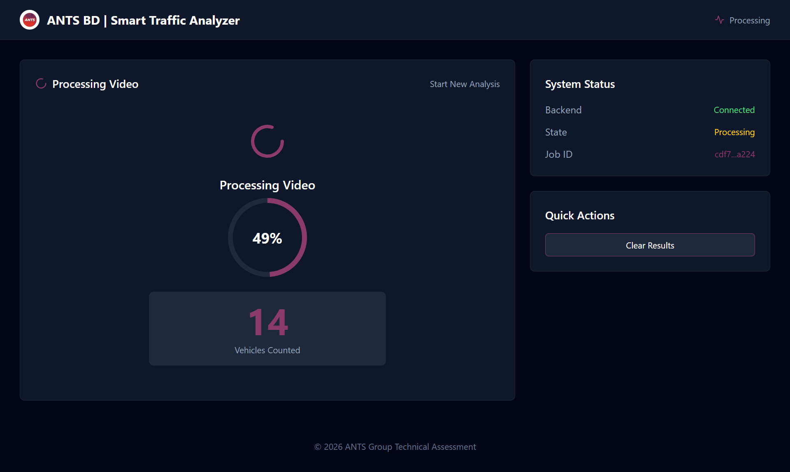
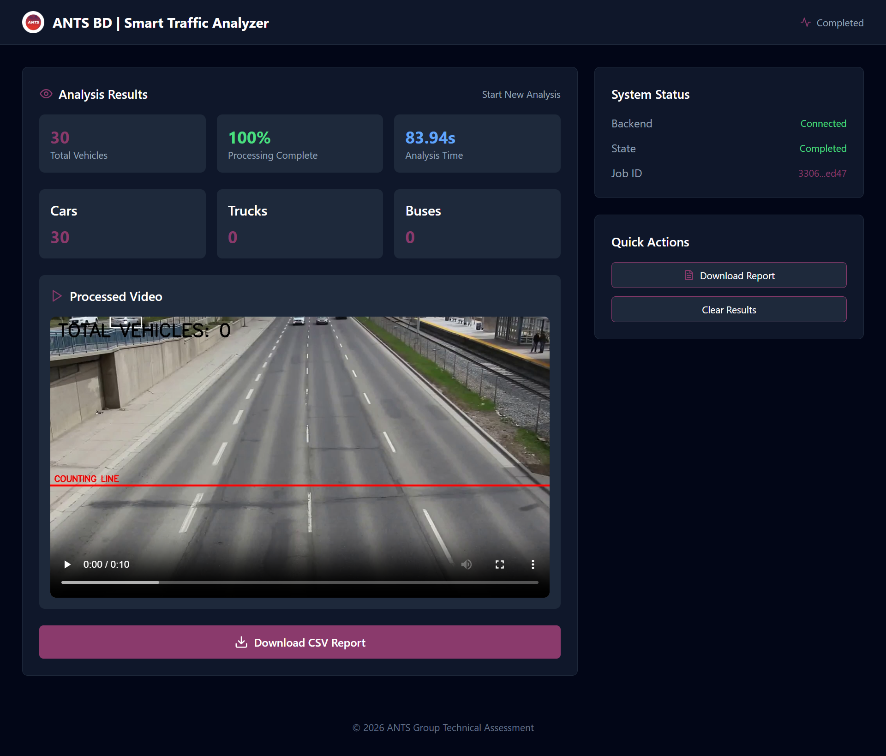

# Smart Drone Traffic Analyzer
An end-to-end traffic surveillance system that uses Computer Vision to identify, track, and count vehicles in drone footage. Built for high-performance processing of both short-form clips and long-form (30min+) datasets.
## Local Setup & Installation

### Prerequisites
Make sure you have the following installed:
- Python 3.10+
- Node.js & npm

---

### Backend Setup

```bash
# Navigate to backend
cd backend

# Create virtual environment
python -m venv venv

# Activate virtual environment

# On Windows
.\venv\Scripts\activate

# On macOS / Linux
source venv/bin/activate

# Install dependencies
pip install -r requirements.txt

# Run the backend server
uvicorn app.main:app --reload
```

---

### Frontend Setup

```bash
# Navigate to frontend
cd frontend

# Install dependencies
npm install

# Start development server
npm run dev
```

---

### Access the Application

Once both servers are running:

- Frontend: http://localhost:5173 *(or as shown in terminal)*
- Backend API: http://127.0.0.1:8000

## 🎯 Interface Overview

### 🏠 Landing Page
Initial interface for uploading and starting the processing pipeline:


---

## 📸 Demo / Output

### 🟡 Processing State
Real-time progress tracking with live vehicle count:



---

### 🟢 Final Output
Processed video with vehicle detection and counting overlay:




## System Architecture

The application follows a **decoupled full-stack architecture** to ensure a responsive UI during computationally heavy video processing.

### Backend (FastAPI & YOLOv8)
- Built with FastAPI for high-performance asynchronous handling  
- Video processing runs via `BackgroundTasks` to avoid blocking requests  
- API immediately returns a **Job ID**, preventing browser timeouts (even for long videos ~30+ minutes)

### Frontend (React & Vite)
- Designed with a **“Command Center” UI** using Tailwind CSS  
- Communicates with backend via **REST polling (every 2 seconds)**  
- Polling was chosen over WebSockets for simplicity, reliability, and easier debugging because the processing jobs are long-running and infrequent.

### Storage Strategy
- Static directory mounted for serving processed outputs  
- Videos and CSV reports are accessed directly via URLs  
- Reduces API overhead and improves delivery efficiency  

---

## API Reference

### Base URL
```
http://127.0.0.1:8000
```

### Endpoints

#### GET `/`
Root endpoint to verify API is running.

**Response:**
```json
{
  "message": "Welcome to Smart Drone Traffic Analyzer API",
  "status": "running",
  "version": "1.0.0",
  "description": "Upload drone videos to detect and track vehicles"
}
```

---

#### POST `/upload`
Upload video file and create processing job.

**Request:** `multipart/form-data`
- `file` (required): Video file (MP4, AVI, MOV)

**Response:**
```json
{
  "job_id": "12345678-1234-1234-1234-123456789abc",
  "message": "Video uploaded successfully"
}
```

**Error Response:**
```json
{
  "detail": "Upload failed: File size exceeds limit"
}
```

---

#### GET `/status/{job_id}`
Get job status and progress information.

**Path Parameters:**
- `job_id`: UUID returned from upload endpoint

**Response:**
```json
{
  "status": "processing",
  "progress": 45,
  "total_count": 12,
  "type_counts": {
    "car": 8,
    "truck": 3,
    "bus": 1
  },
  "processing_duration": 23.5,
  "processed_video_url": "/static/processed_12345678-1234-1234-1234-123456789abc.mp4",
  "report_url": "/static/report_12345678-1234-1234-1234-123456789abc.csv"
}
```

**Status Values:**
- `processing`: Video is being analyzed
- `completed`: Processing finished successfully
- `failed`: Processing encountered an error

**Error Response:**
```json
{
  "detail": "Job not found"
}
```

---

#### GET `/download/video/{job_id}`
Download processed video file.

**Path Parameters:**
- `job_id`: UUID of completed job

**Response:** Video file (MP4) with filename `processed_{job_id}.mp4`

**Error Responses:**
```json
{
  "detail": "Job not found"
}
```
```json
{
  "detail": "Video not available"
}
```

---

#### GET `/download/report/{job_id}`
Download CSV report file.

**Path Parameters:**
- `job_id`: UUID of completed job

**Response:** CSV file with filename `report_{job_id}.csv`

**Error Responses:**
```json
{
  "detail": "Job not found"
}
```
```json
{
  "detail": "Report not available"
}
```

---

### Usage Example

```bash
# 1. Upload video
curl -X POST "http://127.0.0.1:8000/upload" \
  -F "file=@traffic_video.mp4"

# Response: {"job_id": "abc-123", "message": "Video uploaded successfully"}

# 2. Check status
curl "http://127.0.0.1:8000/status/abc-123"

# 3. Download processed video (when completed)
curl "http://127.0.0.1:8000/download/video/abc-123" \
  -o processed_video.mp4

# 4. Download CSV report
curl "http://127.0.0.1:8000/download/report/abc-123" \
  -o traffic_report.csv
```

---

### File Storage
- Processed videos and reports are stored in `/storage/` directory
- Static files served at `/static/` prefix
- Files are automatically cleaned up after 24 hours

---

## Tracking Methodology & Edge Case Handling

To address **double-counting and occlusions**, the system implements a custom  
**Bidirectional Leading-Edge Counting Engine**.

### 1. Temporal State Tracking
- Maintains a `track_history` dictionary across frames  
- Detects **crossing events** using motion over time (not single-frame position)  
- Solves the “teleportation” issue where fast vehicles skip the counting line  

---

### 2. Bidirectional Leading-Edge Logic
Handles traffic moving in both directions:

- **Downward traffic** → triggered when bottom edge (`y2`) crosses the line  
- **Upward traffic** → triggered when top edge (`y1`) crosses the line  

This ensures vehicles are counted **as soon as they enter the zone**, regardless of direction or perspective.

---

### 3. Double-Counting Prevention
- Uses a persistent **Unique ID Registry** (`set`)  
- Each tracked object is counted only once per session  
- Handles:
  - Vehicles stopping on the line  
  - Bounding box jitter / oscillation  

---

## ⚙️ Engineering Assumptions & Optimizations

### Adaptive Frame Skipping
- Detects video duration dynamically  
- `< 60s` → process every frame (maximum accuracy)  
- `≥ 60s` → apply frame skipping (`FRAME_SKIP = 3–5`) for performance  

---

### Hybrid Visualization Preview
- Visual overlays rendered only for the **first 120 seconds**  
- Full video still processed in the background  
- Ensures:
  - Smaller output files  
  - Smooth browser playback  
  - Complete and accurate final CSV report  

---

### Native Browser Compatibility
- Videos encoded using **H.264 (`avc1`) codec**  
- Ensures seamless playback in standard HTML5 video players  
- No external plugins required  

